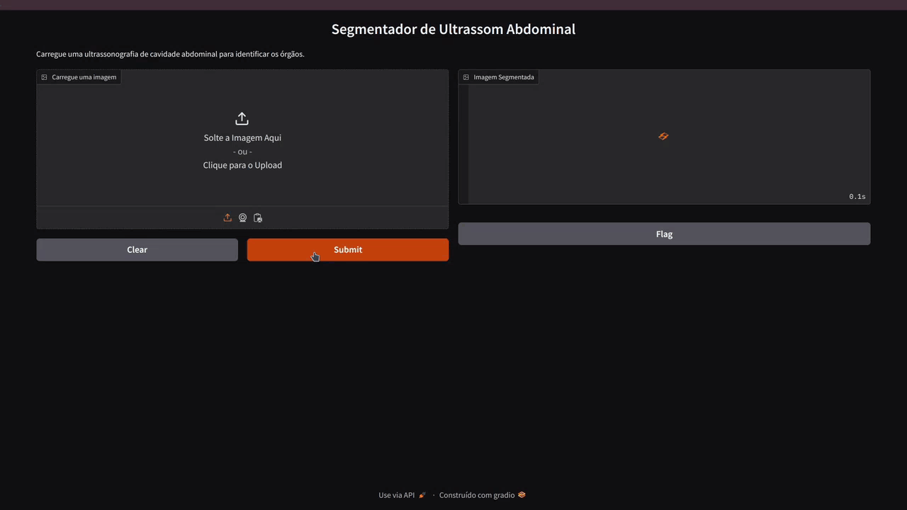

# Segmentação semântica de órgãos abdominais em ultrassom com U-Net
Este é o repositório do projeto **Segmentador de Ultrassom Abdominal**, um segmentador semântico de órgãos abdominais em imagens de ultrassom, treinado com a arquitetura U**-net**, implementado com *Tensorflor/Keras* e interface gráfica *Gradio*.

<p align="center">
  
</p>

## Funcionalidades
- Segmenta 8 órgãos abdominais diferentes
- Gera máscara sobreposta à imagem original
- Interface gráfica intuitiva com legenda de cores
- Pipeline completo para treinamento de modelos de segmentação com U-net e variantes.

## Arquitetura
A arquitetura da rede foi implementada manualmente seguindo o artigo original "U-Net: Convolutional Networks for Biomedical Image Segmentation", disponível no link: https://arxiv.org/pdf/1505.04597v1 

Para a modelagem da rede, foi utilizado o framework **TensorFlow** com a **API Keras**.

## Exemplos de predições: 


## Instalação

1. Clone o repositório:
    ```bash
    git clone 
    cd 
    ```

2. Instale as dependências do projeto:
    pip install -r requirements.txt


## Utilização
Para realizar segmentações em imagens de ultrassom ou treinar o sua própria versão, siga os passos a seguir:


### Predição com interface iterativa
Execute o script *segmentador.py* para iniciar uma interface web, onde poderão ser feitas as predições:
<p align="center">
  
</p>

```bash
python segmentador.py
```

### Treinamento

1. Processar os datasets:
Execute o script *preprocessing.py* para tratar os dados do dataset, conforme o fluxograma:


Alterando algumas variáveis e caminhos do código, é possivel processar outros tipos de datasets para U-net

```bash
python preprocessing.py
```

2. Treinar e verificar métricas:
- Defina os hiperparâmetros para compilação e treinamento do modelo
- Execute o script training_eval.py 

```bash
python training_eval.py
```
Ao final do treiamento, um gráfico com as métricas será exibido, e o a versão do modelo com melhor desempenho durante o treinamento será salva na pasta *Modelos*

4. Testar em um conjunto de imagens:
- Abra o script *test_save*, altere o parâmetro *modelname* com o título do modelo a ser carregado para realizar o teste.
- Altere o parâmetro *model_name* com o nome do arquivo do modelo a ser testado.
- Altere o parâmetro de *predict* para definir em qual subconjunto será feito o treino.
- Altere o parâmetro *testename* para definir o nome do diretório em que será salvo as predições do teste. Um novo diretório será criado caso ele não exista.


```bash
model_name = 'Aug02'
model = load_model(f'Modelos/modelo_{model_name}.keras')

... 
X_train, X_val, X_test, y_train, y_val, y_test = load_dataset(save_dir="Data")

...

y_pred=model.predict(X_test)

...

testename = "Teste5"
```
Altere o parâmetro

```bash
python test_save.py
```
- As imagens salvas serão uma combinação da imagem real, o ground truth e a predição, assim como em [Exemplos de predições](##Exemplos de predições:)

## Dataset

**US simulation & segmentation**

Disponível no kaggle pelo link: https://www.kaggle.com/datasets/ignaciorlando/ussimandsegm

Este dataset foi desenvolvido com  imagens reais de ultrassonografia e imagens sintéticas geradas por um simulador baseado em ray-casting, a partir de dados volumétricos de **Tomografia Computadorizada**. As imagens representam órgãos abdominais, como fígado, pâncreas, adrenais, vesícula biliar, baço, vasos sanguíneos e ossos, totalizando 694 imagens anotadas divididas entre os conjuntos reais e sintéticos.

**Conteúdo**
O dataset está dividido entre imagens reais e imagens sintéticas, já separados em subconjuntos de treino e teste.

1. **Imagens Reais de Ultrassonografia:** Total de 617 imagens
   
	1. **Treino:
		- 404  imagens reais de ultrassonografia.
		- Nenhuma imagem possui anotação no subconjunto de treino.
	2. **Teste:**
		 - 213 imagens reais de ultrassonografia.
		 - 61 máscaras de segmentação anotadas manualmente.

2. **Imagens Sintéticas de Ultrassonografia:** Total de 926 imagens

   

	1. **Treino:**
		-  633 imagens sintéticas de ultrassonografia.
	    - 633 máscaras de segmentação
    1. **Teste:**
		-  293 imagens sintéticas de ultrassonografia.
		- 293 máscaras de segmentação anotadas automaticamente.

**Anotações**
As anotações são representadas por cores que identificam diferentes órgãos abdominais:

- **Violeta:** Fígado.
- **Amarelo:** Rins.
- **Azul:** Pâncreas.
- **Vermelho:** Vasos.
- **Azul claro:** Adrenais.
- **Verde:** Vesícula biliar.
- **Branco:** Ossos.
- **Rosa:** Baço.

## Estrutura do Projeto

```bash
├── Data                     # Diretório com datasets e conjuntos treino/validação/teste
├── Modelos                  # Diretório com modelos treinados
├── src                      # Códigos fonte
│   ├── preprocessing.py     # Pré-processamento e divisão de conjuntos
│   ├── utils.py             # Funções auxiliares
│   ├── model.py             # Arquitetura da U-Net 
│   ├── training_eval.py     # Treinamento e avaliação do modelo
│   └── test_save.py         # Testa modelo e salva o lote de predições
├── Testes                   # Diretório com os testes de predição
├── requirements.txt         # Dependências do projeto
├── Segmentação_Semântica_Abdominal.pdf  # Relatório de desenvolvimento do projeto
├── app_segmentador.py           # Roda a interface para fazer as predições
├── README.md                # Este arquivo
```
